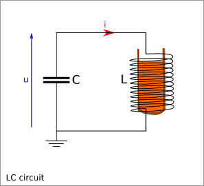

==========================
Notes on Induction Furnace
==========================

Presentation
============

The *metal* is an interesting material because of its *rigidity*. This property let us make mechanical parts that are closed to an ideal solid, which shapes and dimensions do not vary regardless of the applied strength and temperatures.

The high rigidity of the metal is also an issue when it comes to form the shape of the parts. Direct strength become inefficient. Two methods let us bypass the rigidity property of the metal:

- the electro-erosion takes advantage of the electrical conductivity of the metal
- the fusion (i.e. foundry) takes advantage of the relative small quantity of energy required to melt a metal

For years, the difficulty was to bring the thermal energy to the metal at high temperature. But nowadays, thanks to the induction technology, it is quiet easy to bring this energy as the heat is generated within the metal.

Induction overview
==================

An LC-circuit generates an alternative magnet field, which generates *Foucault current* (a.k.a. Eddy current), which generates heat thanks to the Ohmic law.

The Ohmic law:

.. math::  W_{th} = R * I^2

Wth : the thermal power generated by a current

The Foucault current are limited to the area closed to the surface of the metal if the frequency is too high. This is the `skin effect`_

.. _`skin effect`: https://en.wikipedia.org/wiki/Skin_effect

Thickness of the skin effect:

.. math:: Thickness = \frac{1}{\sqrt{conductivity * permeability * \pi * frequency}}
.. math:: frequency = \frac{1}{Thickness^2 * \pi * conductivity * permeability}

=========   =========   ============
Material    Iron        Copper
Thickness
=========   =========   ============
10 mm       0.05 Hz         43 Hz
8 mm        0.08 Hz         67 Hz
6 mm        0.1 Hz         119 Hz
4 mm        0.3 Hz         269 Hz
2 mm        1.2 Hz        1075 Hz
1 mm        5 Hz          4300 Hz
=========   =========   ============

To get enough thickness for the *Foucault current*, we work with a frequency below 1kHz. So we can melt all metal. Also, at high temperature, the iron loses its high magnetic permeability, which makes it behave closer to the copper regarding the skin effect.

LC circuit
==========

To create an alternative magnetic field, we need an oscillating circuit like the LC-circuit.

Formula:

.. math:: u = L \frac{di}{dt}
.. math:: i = C \frac{du}{dt}
.. math:: f = \frac{1}{2 \pi \sqrt{L C}}
.. math:: E_{cap} = \frac{C u^2}{2}
.. math:: E_{ind} = \frac{L i^2}{2}

Inductance sizing
=================

The volume of 1kg of iron is 127000 mm^3. In chip, it may requires the double volume, that means 250000 mm^3 or 50*50*3.14*30, a cylinder of radius 50 mm and height 30 mm.

Cylindrical inductance:

.. math:: L = \mu_0 N^2 \frac{A}{l}
.. math:: \mu_0 = 4 \pi 10^{-7} H m^{⁻1}

Considering a cylindrical inductance of radius 80 mm (diameter: 160 mm) and a height of 30 mm. If the wire loop are distance of 5 mm, we get 6 loops for one way. For both ways, we get 12 loops:

.. math:: A = 0.08^2 \pi = 0.02 m^2
.. math:: l = 0.03 m
.. math:: N = 12
.. math:: L = 0.00012 H = 0.12 mH

Capacitor sizing
================

To reach a resonance frequency of 1kHz, we need a capacitor of:

.. math:: C = \frac{1}{(2 f \pi)^2 * L}
.. math:: C = 0.000211 F = 0.211 mF

Power transfer
==============

We want to transfer the energy from electricity to heat up to 1kW i.e. 1kJ/s. We have 1000 oscillations per second.

If each oscillation transfers completely its energy in one oscillation, we need 1J in the LC-oscillation:

.. math:: u = \sqrt{ \frac{2 E_{cap}}{C} } = 97.3 (V)
.. math:: i = \sqrt{ \frac{2 E_{ind}}{L} } = 129.1 (A)

If 10% of the energy is transfer per oscillation, we need 10J oscillating in the LC-circuit::

  u = 307 (V)
  i = 408 (A)

If 1% of the energy is transfer per oscillation, we need 100J oscillating in the LC-circuit::

  u =  973 (V)
  i = 1291 (A)

