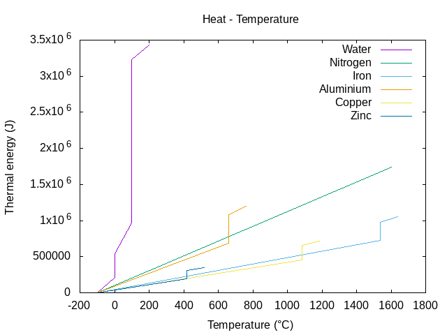

==========================
Notes on Induction Furnace
==========================

Requirements
============

Energy for fusion
-----------------

At 101325 Pa (normal atmospheric pressure)

=================     ============   ==========  ============  ============  ============  ==================  ==========
Material              Cp [solid]     Fusion Tc   Fusion heat   Cp [liquid]   Boiling Tc    Vaporization heat   Cp [gaz]
Units                 J/(kg.K)       °C          J/kg          J/(kg.K)      °C            J/kg                J/(kg.K)
=================     ============   ==========  ============  ============  ============  ==================  ==========
Water (H2O)           2108           0           334000        4187            100           2264705             1996
Nitrogen (N2)                        -210         25700                       -196            200000              1025
Iron (Fe)             444            1538        247134         820           2861           6214000
Aluminium (Al)        897            660.3       396590        1180           2519          10859000
Copper (Cu)           385            1084.6      206170         490           2562           4721000
Zinc (Zn)             380            419.5       112402                        907           1819000
=================     ============   ==========  ============  ============  ============  ==================  ==========

Energy to melt 1 kg of metal::

  Water-steam   :  100 * 4187 + 2264705 = 2683405 J  <=> 0.745 kW/h
  Iron          : 1538 *  444 +  247134 =  930006 J  <=> 0.258 kW/h
  Aluminium     :  669 *  897 +  396590 =  996683 J  <=> 0.276 kW/h
  Copper        : 1084 *  385 +  206170 =  623510 J  <=> 0.173 kW/h
  Zinc          :  419 *  380 +  112402 =  271622 J  <=> 0.075 kW/h

Reminder::

  1 bar = 100000 Pa
  1 Pa = 1 N/m2 = 1 J/m3
  1 cal = 4.1855 J
  1 mol = 6.022 * 10**23

Auxiliary table
---------------

=================     ===========    ================   =====================   =======================  ======================
Material              Molar mass     Specific volume    Thermal conductivity    Electrical resistivity   Magnetic permeability
Units                 kg/mol         m3/kg              W/(m.K)                 Ohm.m                    H/m
=================     ===========    ================   =====================   =======================  ======================
Ice (H2O)             0.018          0.00109
Water (H2O)           0.018          0.00100            0.6                     20                       0.99
Steam (H2O)           0.018          1.24
Nitrogen (N2)         0.02802        0.799              0.026                   10**9                    1.00
Iron (Fe)             0.05584        127.0 * 10**-6     80.4                    9.70 * 10**-8            5000
Aluminium (Al)        0.02698        370.4 * 10**-6     237                     2.65 * 10**-8            1.00
Copper (Cu)           0.06354        111.6 * 10**-6     384.1                   1.68 * 10**-8            0.99
Zinc (Zn)             0.06539        140.0 * 10**-6     116                     5.90 * 10**-8            0.99
=================     ===========    ================   =====================   =======================  ======================

